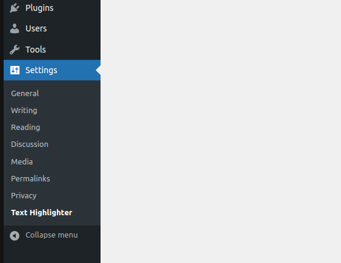
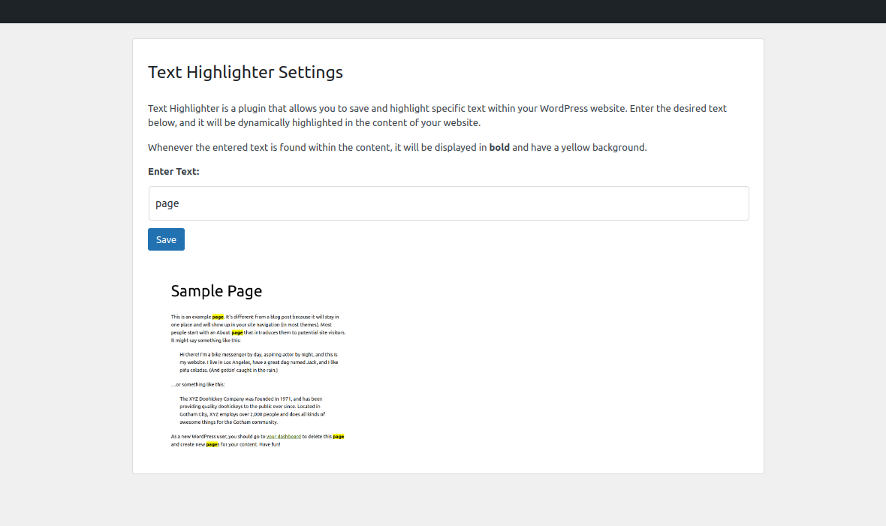
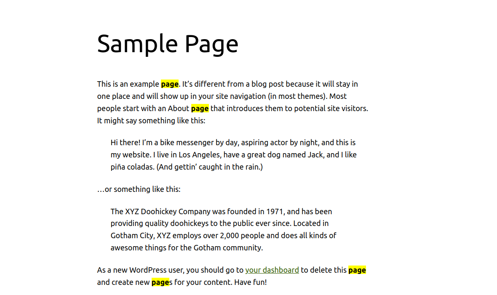

# text-highlighter-wordpress-plugin

The Text Highlighter plugin empowers you to effortlessly draw attention to specific text within your WordPress website. With this powerful tool, you can save and highlight crucial content, making it stand out.

## Features

- Save and manage specific text for highlighting.
- Dynamically highlight specified text substrings on the public-facing website.
- Highlighted text appears in bold with a yellow background.
- Customizable settings and easy-to-use interface.

## Screenshots

## Installation

There are two methods to install the Text Highlighter plugin:

**Method 1: Upload Plugin ZIP via WordPress Dashboard**

1. Log in to your WordPress admin panel.
2. Navigate to "Plugins" -> "Add New".
3. Click the "Upload Plugin" button at the top of the page.
4. Choose the Text Highlighter plugin ZIP file from your computer.
5. Click the "Install Now" button and wait for the installation to complete.
6. Once installed, click the "Activate" button to activate the plugin.

**Method 2: Upload Plugin Files via FTP**

1. Download the Text Highlighter plugin ZIP file from the plugin repository.
2. Extract the downloaded ZIP file to get the plugin folder.
3. Connect to your website using an FTP client (e.g., FileZilla, Cyberduck).
4. Navigate to the wp-content/plugins/ directory on your server.
5. Upload the "text-highlighter" folder to the plugins directory.
6. Log in to your WordPress admin panel.
7. Navigate to "Plugins" and locate the "Text Highlighter" plugin in the list.
8. Click the "Activate" link to activate the plugin.

## Usage

1. After activating the Text Highlighter plugin, a new menu item named "Text Highlighter" will appear in the WordPress admin sidebar under "Settings".
2. Click on the "Text Highlighter" menu item to access the plugin settings page.
3. On the settings page, enter the desired text in the input field.
4. Click the "Save" button to save the entered text.
5. The specified text will be dynamically highlighted on the public-facing website. Whenever the entered text is found within the content, it will appear in bold with a yellow background.

## Customization

You can customize the appearance and behavior of the Text Highlighter plugin:

- To change the styling of the plugin page, modify the CSS in the `css/text-highlighter-styles.css` file.
- To adjust the highlighting behavior, you can update the `text_highlighter_modify_content` function in the `text-highlighter.php` file.

## Support and Feedback

If you encounter any issues or have any feedback or suggestions regarding the Text Highlighter plugin, please feel free to submit an issue on the GitHub repository.

